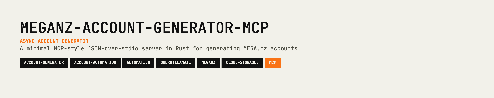

<p align="center">
  
</p>

<p align="center">
  <a href="https://crates.io/crates/meganz-account-generator-mcp"></a>
  <a href="https://opensource.org/licenses/MIT"></a>
  <a href="#overview"></a>
  <a href="https://github.com/11philip22/meganz-account-generator-mcp/pulls"></a>
</p>

<p align="center">
  <a href="#what-does-this-do">What does this do?</a> · <a href="#installation">Installation</a> · <a href="#quick-start">Quick Start</a> · <a href="#generating-accounts">Generating Accounts</a> · <a href="#options">Options</a> · <a href="#other-commands">Other Commands</a> · <a href="#troubleshooting">Troubleshooting</a> · <a href="#contributing">Contributing</a> · <a href="#support">Support</a> · <a href="#license">License</a>
</p>

---

## What does this do?

This tool lets you **automatically generate MEGA.nz accounts** from the command line. Instead of filling out the MEGA registration form manually, you can create one or more accounts in seconds with a single command.

It works as a lightweight server that you send requests to — useful for automation, testing, or bulk account creation.

## Installation

You'll need [Rust and Cargo](https://rustup.rs/) installed. Then run:

```bash
cargo install meganz-account-generator-mcp
```

That's it! The `meganz-account-generator-mcp` command will now be available on your system.

## Quick Start

**1. Start the server:**
```bash
cargo run
```

**2. Send it a request to generate an account:**
```json
{"id":"1","method":"mega/generate","params":{"count":1,"password":"MyPassword123!"}}
```

**3. You'll get back the new account details:**
```json
{
  "accounts": [
    {
      "email": "example@mega.nz",
      "password": "MyPassword123!",
      "name": "Example Name"
    }
  ]
}
```

## Generating Accounts

### Generate a single account
```json
{"id":"1","method":"mega/generate","params":{}}
```

### Generate multiple accounts at once
```json
{"id":"1","method":"mega/generate","params":{"count":3}}
```

### Use a specific password
```json
{"id":"1","method":"mega/generate","params":{"count":2,"password":"MySecurePass!"}}
```

> **Note:** By default, up to 5 accounts can be generated per request.

## Options

### Using a proxy

If you need to route traffic through a proxy (e.g. for privacy or rate limiting):

```bash
# Via environment variable
MEGA_PROXY_URL=http://127.0.0.1:8080 cargo run

# Via command-line flag
cargo run -- --proxy-url http://127.0.0.1:8080
```

## Other Commands

### Check server info
```json
{"id":"1","method":"server/info","params":null}
```

### List available tools
```json
{"id":"1","method":"tools/list","params":null}
```

## Troubleshooting

**Account generation is failing**
- Try using a proxy — MEGA may rate-limit requests from certain IP addresses.

**I'm not seeing any output**
- Make sure you're sending newline-delimited JSON (each request on its own line).
- Check `stderr` or your log file for error messages.

**How do I know it's working?**
- Try the `server/info` command first. If you get a response, the server is running correctly.

## Contributing

Contributions are welcome! Please feel free to submit a Pull Request.

1. Fork the repository
2. Create your feature branch (`git checkout -b feature/cool-feature`)
3. Commit your changes (`git commit -m 'Add some cool feature'`)
4. Push to the branch (`git push origin feature/cool-feature`)
5. Open a Pull Request

## Support

If this crate saves you time or helps your work, support is appreciated:

[](https://ko-fi.com/11philip22)

## License

This project is licensed under the MIT License; see the [LICENSE](LICENSE) file for details.
